# A TALE OF THREE CITIES

<!-- 
Guidelines on README format: https://review.docs.microsoft.com/help/onboard/admin/samples/concepts/readme-template?branch=master

Guidance on onboarding samples to docs.microsoft.com/samples: https://review.docs.microsoft.com/help/onboard/admin/samples/process/onboarding?branch=master

Taxonomies for products and languages: https://review.docs.microsoft.com/new-hope/information-architecture/metadata/taxonomies?branch=master
-->
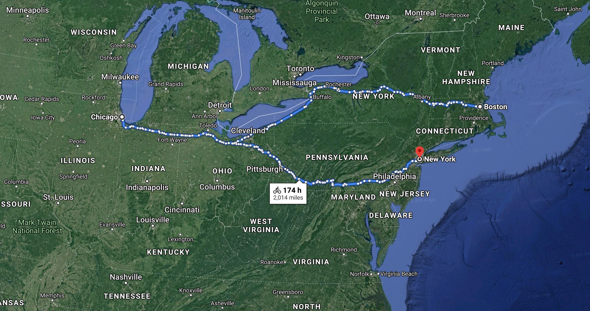
## Introduction

  With 174 hours of biking and a bit of ferry combined you can start from Boston, touch Chicago, and reach the city of New York.  However different these cities are, they all have one thing in common the 311 service. 
  
  The telephone number 3-1-1 creates a central hub for local subscribers to access a variety of city services. 311 provides access to non-emergency municipal services from sewer concerns, pothole problems, abandoned car removal and neighborhood complaints to graffiti removal. This service is available to divert routine inquiries and non-urgent community concerns from the 9-1-1 number which is reserved for emergency service. A promotional website for 3-1-1 in Akron described the distinction as follows: “Burning building? Call 9-1-1. Burning question? Call 3-1-1” (wiki/3-1-1, n.d.) 
  
  A recent 15-city study of 311 by the Pew Charitable Trusts found that the average cost per 311 call is $3.39. Detroit came in with the highest cost per call at a whopping $7.78. Despite the excessive costs, cities do not appear to be slowing their migration to 311. In fact, many are pushing forward with faith that the increased efficiency, streamlined processes and customer satisfaction they achieve will ultimately pay off (Brown, 2012) .
  
  We have identified the 3-1-1 call dataset from the cities Chicago, Boston and New York city provided by Azure Open Datasets. We believe that data is the new currency, now the question becomes what can we do with the 3-1-1 data and how can that analysis be beneficial?

## Focus Area

  In this paper I want to examine how the incidents reported in these three cities are related albeit imperfectly with time, clusters of incidents. Some of the questions and problems that is addressed are as follows:
  * Transformation and enrichment of the datasets.
  * Perform descriptive analytics on the data.
  * Time series analysis and visualization
  * Cluster visualization and analysis
  * Time series forecasting and comparison using various methods
  * Anomaly detection and reporting 
  * Correlation among the incidents occurring the three cities w.r.t time
  
  Because of the varied nature of the incidents and analysis (descriptive and predictive) that can be performed on them, I demonstrated some of the concepts by means of isolating the pothole repair complaints which also ranks within the top 10 categories of complaints in the three cities (as we will demonstrate here as well). However, these methodologies can be seamlessly applied and reused across other categories of complaints with little modification.
  
## Value Proposition
  This analysis can serve as a reference point and with refinement can be reused in the optimization of the Maintenance Fiscal budget of a city. The Development and the Maintenance services budget includes General Services, Public Works, Planning & Development and Solid Waste Management. This budget occupies a large portion in a city's overall fiscal budget and by the application and refinement of the descriptive and predictive analytics demonstrated as part of this work we can statistically optimize and predict the overall spending and budgeting. Here is an example of City of Houston’s 2019 Fiscal Year budget breakdown to give an idea of the general breakdown of the development and maintenance services components: https://www.houstontx.gov/budget/19budadopt/I_TABI.pdf
  
Secondly, this work can be used as a workshop, reference material and self-learning for the following concepts, technologies, and platforms:
* Data Engineering using SparkR, R ecosystem
* Data visualization and descriptive analytics
* Time Series forecasting
* Anomaly detection
* Products used: Azure Databricks, Azure Open Datasets, Azure Blob Storage

In the second phase I plan to develop another flavor solution using Azure Synapse Analytics and Azure Machine learning primarily using Python, REST APIs and PySpark.

## Guiding Principles
The work that will be subsequently done as part of this paper will have at the very least embody the following principles (ai/responsible-ai, n.d.):
*	Fair - AI must maximize efficiencies without destroying dignity and guard against bias
*	Accountable - AI must have algorithmic accountability
*	Transparent - AI systems must be transparent and understandable
*	Ethical - AI must assist humanity and be designed for intelligent privacy

## Contents

Outline the file contents of the repository. It helps users navigate the codebase, build configuration and any related assets.

| File/folder       | Description                                |
|-------------------|--------------------------------------------|
| `src`             | Sample source code.                        |
| `.gitignore`      | Define what to ignore at commit time.      |
| `CHANGELOG.md`    | List of changes to the sample.             |
| `CONTRIBUTING.md` | Guidelines for contributing to the sample. |
| `README.md`       | This README file.                          |
| `LICENSE`         | The license for the sample.                |

## Target Audience
* Architects
* Data Scientists
* Data Engineers
* R and Spark Developers

## Pre-Requisite Knowledge
* Prior knowledge of Spark, is beneficial
* Familiarity/experience with R and Azure

## Azure Pre-Requisites
A subscription with at least $200 credit for a continuous 15-20 hours of usage.

## Building Blocks

The building blocks section of this README constitutes of the dataset, technologies, platform, third party libraries and a high-level process flow diagram.

### Source Dataset

For this paper the source are the 3 datasets as mentioned blow from Azure Open Datasets (docs.microsoft.com, n.d.) which are hosted in the Azure Blob storage (storage/blobs/, n.d.) which provides a scalable, cost-efficient object storage in the cloud.

#### A. Chicago Safety Data  
Source: https://azure.microsoft.com/en-us/services/open-datasets/catalog/chicago-safety-data/

311 service requests from the city of Chicago, including historical sanitation code complaints, potholes reported, and streetlight issues. All open sanitation code complaints made to 311 and all requests completed since January 1, 2011. This dataset is orginally sourced from city of Chicago government (data.cityofchicago.org, n.d.).

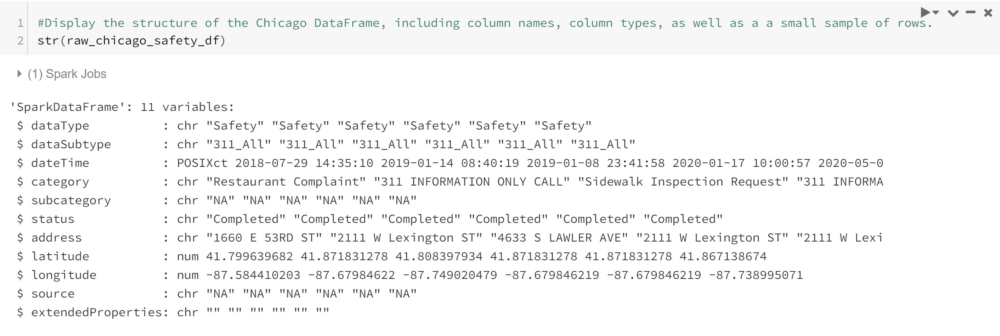

#### B. Boston Safety Data  
Source: https://azure.microsoft.com/en-us/services/open-datasets/catalog/boston-safety-data/

This Dataset contains 311 calls reported to the city of Boston. This dataset contains historical records accumulated from 2011 to the present. This dataset is originially sourced from city of Boston government (data.boston.gov, n.d.). Reference Open Data Commons Public Domain Dedication and License (ODC PDDL) for the license of using this dataset.

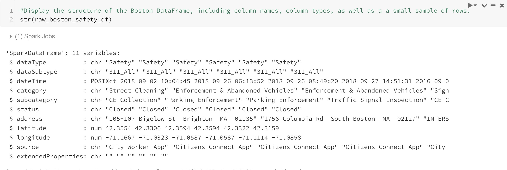

#### C. NewYork City Safety Data  
Source: https://azure.microsoft.com/en-us/services/open-datasets/catalog/new-york-city-safety-data/

This dataset contains historical records of New York City 311 service requests accumulated from 2010 to the present. This dataset is origninally sourced from New York City government (data.cityofnewyork.us, n.d.).

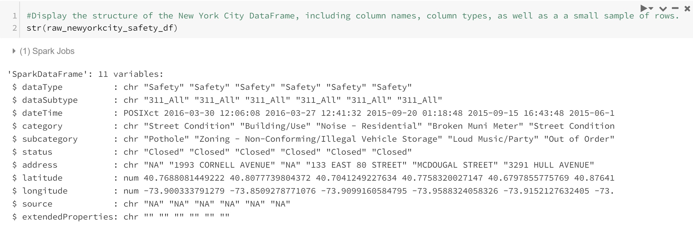

#### Data Volume
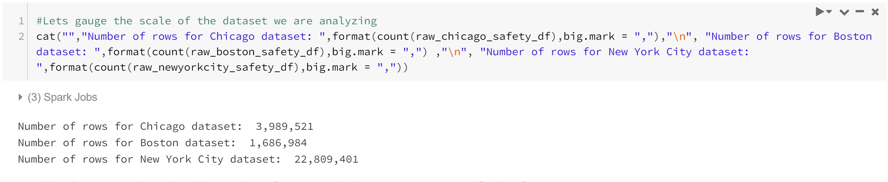

### Technology and Platform

#### Azure Databricks
Azure Databricks is an Apache Spark-based analytics platform optimized for the Microsoft Azure cloud services platform. Azure Databricks is integrated with Azure to provide one-click setup, streamlined workflows, and an interactive workspace that enables collaboration between data scientists, data engineers, and business analysts (azure.microsoft.com, n.d.) .

#### SparkR
An R package that provides a light-weight frontend to use Apache Spark from R (spark.apache.org, n.d.) Provides a distributed DataFrame implementation that supports operations like selection, filtering, aggregation etc. (like R data frames, dplyr). Supports distributed machine learning using Spark MLlib. R programs can connect to a Spark cluster from RStudio, R shell, Rscript or other R IDEs.

#### SparkSQL
Spark SQL (spark.apache.org, n.d.) is a Spark module for structured data processing. Unlike the basic Spark RDD API, the interfaces provided by Spark SQL provide Spark with more information about the structure of both the data and the computation being performed. Internally, Spark SQL uses this extra information to perform extra optimizations. There are several ways to interact with Spark SQL including SQL and the Dataset API. When computing a result, the same execution engine is used, independent of which API/language you are using to express the computation.

#### Azure Blob Storage
Azure Blob Storage helps you create data lakes for your analytics needs and provides storage to build powerful cloud-native and mobile apps. Optimize costs with tiered storage for your long-term data, and flexibly scale up for high-performance computing and machine learning workloads (docs.microsoft.com, n.d.).

#### Azure Key Vault
Azure Key Vault Safeguard cryptographic keys and other secrets used by cloud apps and services. Secure key management is essential to protect data in the cloud.  Azure Key Vault is used to to encrypt keys and small secrets like passwords that use keys stored in hardware security modules (HSMs). https://docs.microsoft.com/en-us/azure/key-vault/general/overview

#### Libraries and Plugins
ggplot2, htmltools, htmlwidgets, leaflet with ESRI plugin, magrittr, 
fpp2, forecast, ggfortify , R base packages, tidyverse , anomalize

### Architecture of the solution
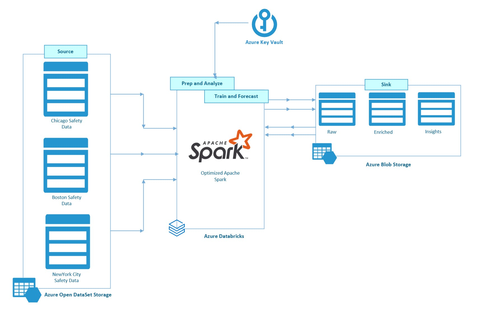

### Process flow and set up
1.	Azure Databricks and Azure Blob Storage account are provisioned in Azure
2.  The source SAS token is stored in Azure Key Vault
3.	Data is read using SparkR notebooks from Azure Open Datasets in Azure Databricks
4.	Data is wrangled and enriched for further analysis using SparkR and stored in Azure Blob Storage.
5.	SparkR and 3rd party libraries are used for data analysis and visualization
6.	SparkR and 3rd party libraries are used for Forecasting and Anomaly detection.

## Data Wrangling and Enrichment
Data is cleansed and enriched using SparkR and SparkSQL. The curated dataset is written in Azure Blob storage in parquet format (parquet.apache.org, n.d.) partitioned by City Name. The Code can be referred from “Step02a_Data_Wrangling” R Notebook from the artifacts section. 

Final Data Structure:

Sink Storage:
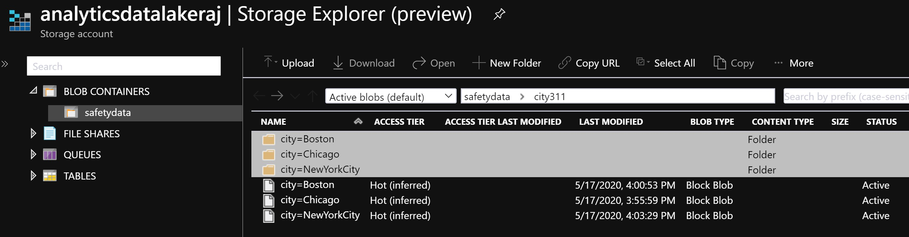

## Data Exploration and Visualization

Data exploration and visualization is done using SparkR, SparkSQL, ggplot2, htmltools, htmlwidgets, leaflet with ESRI plugin, magrittr etc. The Code and detailed exploration can be referred from “Step02b_Data_Exploration_Visualization” R Notebook from the artifacts section. Below are some highlights from this notebook.

#### Top 30 and bottom 30 safety incidents reported in Chicago:
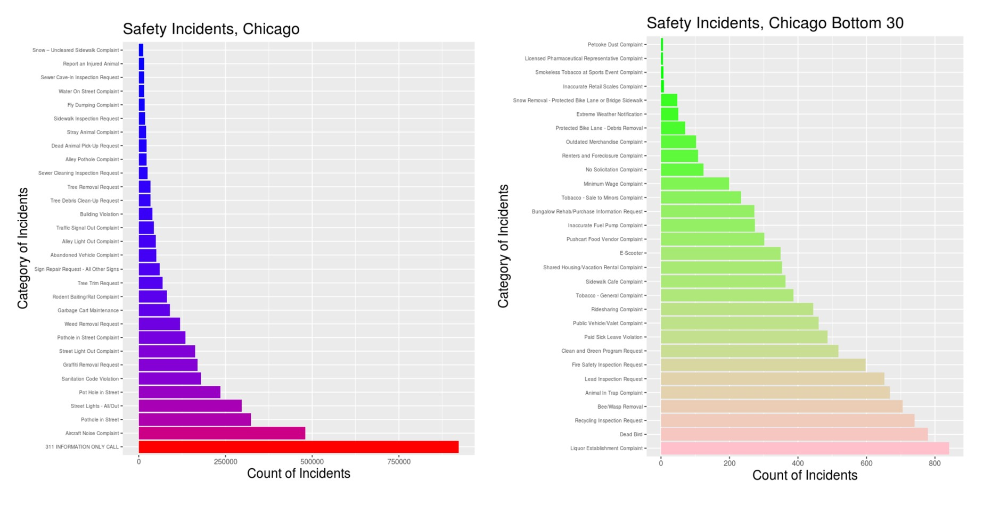

#### Changes Over Time - Volume of All Safety Calls and  specific Safety Calls (Graffiti in this example):
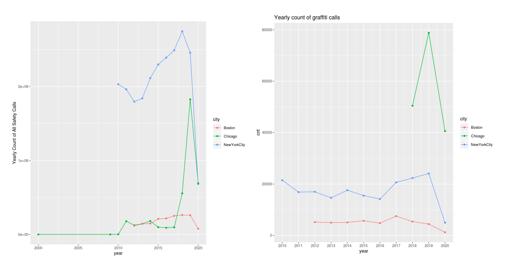

#### Fully explorable geoplot done using leaflet with ESRI plugin (with a subset of the data) attached in the artifacts :
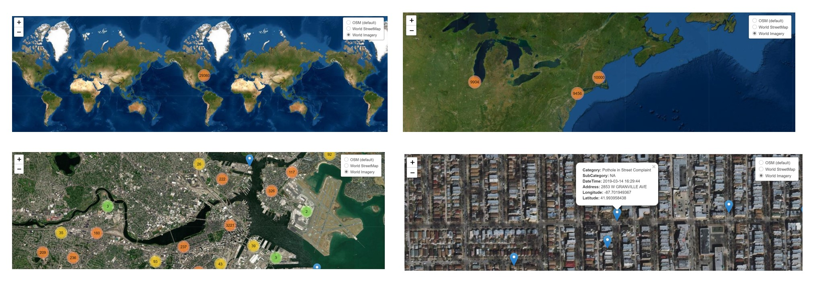

http://htmlpreview.github.io/?https://github.com/microsoft/A-TALE-OF-THREE-CITIES/blob/master/images/rwidgets_safety_events_mapexploration.html

## Problem Isolation
Because of the varied nature of the incidents we tried to demonstrate the concepts using the pothole complaints. Pothole facts from wiki (Pothole#Costs_to_the_public, n.d.) The American Automobile Association estimated in the five years prior to 2016 that 16 million drivers in the United States have suffered damage from potholes to their vehicle including tire punctures, bent wheels, and damaged suspensions with a cost of $3 billion a year. In India, 3,000 people per year are killed in accidents involving potholes. Britain has estimated that the cost of fixing all roads with potholes in the country would cost £12 billion. As mentioned earlier, these methodologies can be seamlessly applied and reused across other categories of complaints with little modification.

## Time Series Analysis and Forecasting
The time series analysis and forecasting are done through SparkR, ggplot2, forecast, ggfortify etc. A time series can be thought of as a vector or matrix of numbers along with some information about what times those numbers were recorded. This information is stored in a ts object in R. ts(data, start, frequency, ...) The Code and detailed exploration can be referred from “Step03a_Model_Training_Testing” R Notebook from the artifacts section. Below are excerpts from this notebook.

#### Monthly time series graph of the pothole incidents reported in 3 cities:
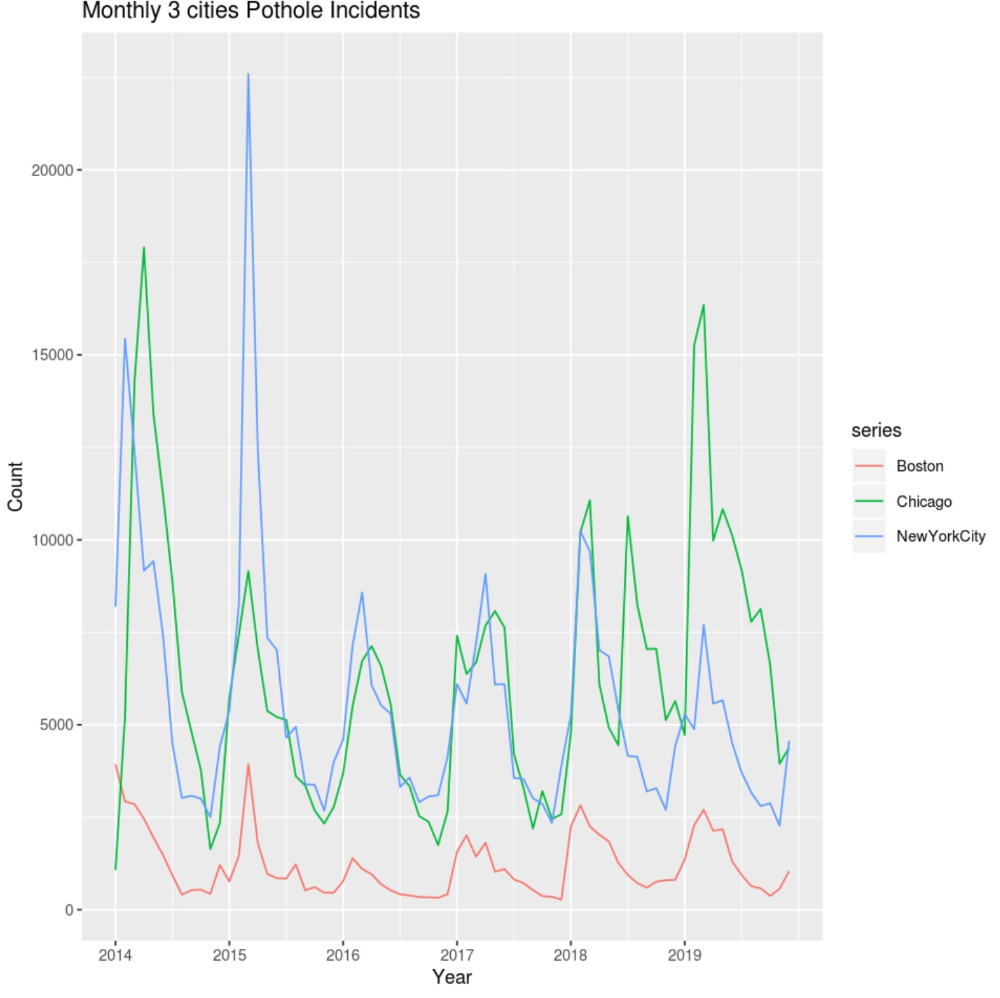

#### Chicago seasonal pothole incidents plots:
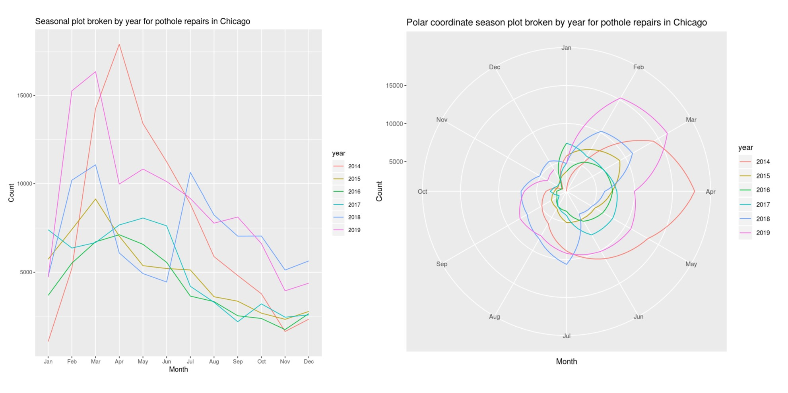

####  Interesting observations:
Can the uptick of pothole repairs in the 3 cities during the first half of the year be attributed to winter months? Can the budget and contract of workers for pothole repair be allocated and spent following the trend?

#### Time Series Forecasting:
Automatic forecasting with exponential smoothing the namesake function for finding errors, trend, and seasonality (ETS) provides a completely automatic way of producing forecasts for a wide range of time series. Predicting Pothole incident occurrence in city of Chicago. When applying a forecasting method, it is important to always check that the residuals are well-behaved (i.e., no outliers or patterns) and resemble white noise. The prediction intervals are computed assuming that the residuals are also normally distributed.

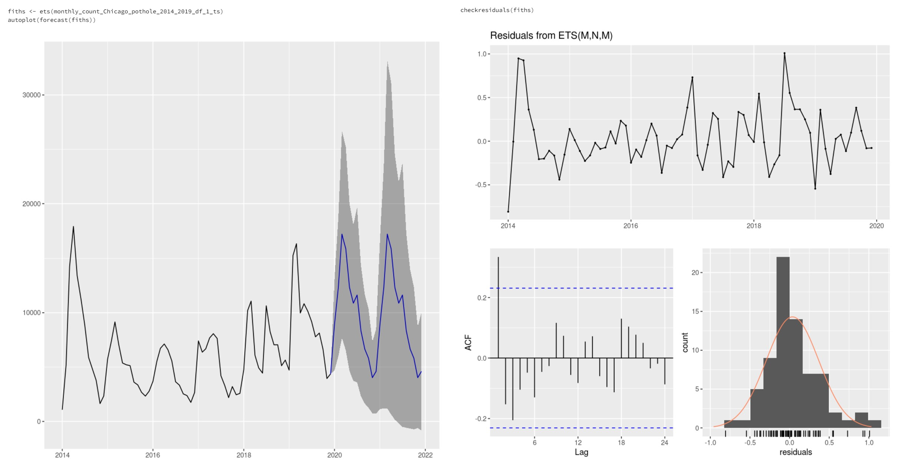

#### Train and compare accuracies against different timeseries models:
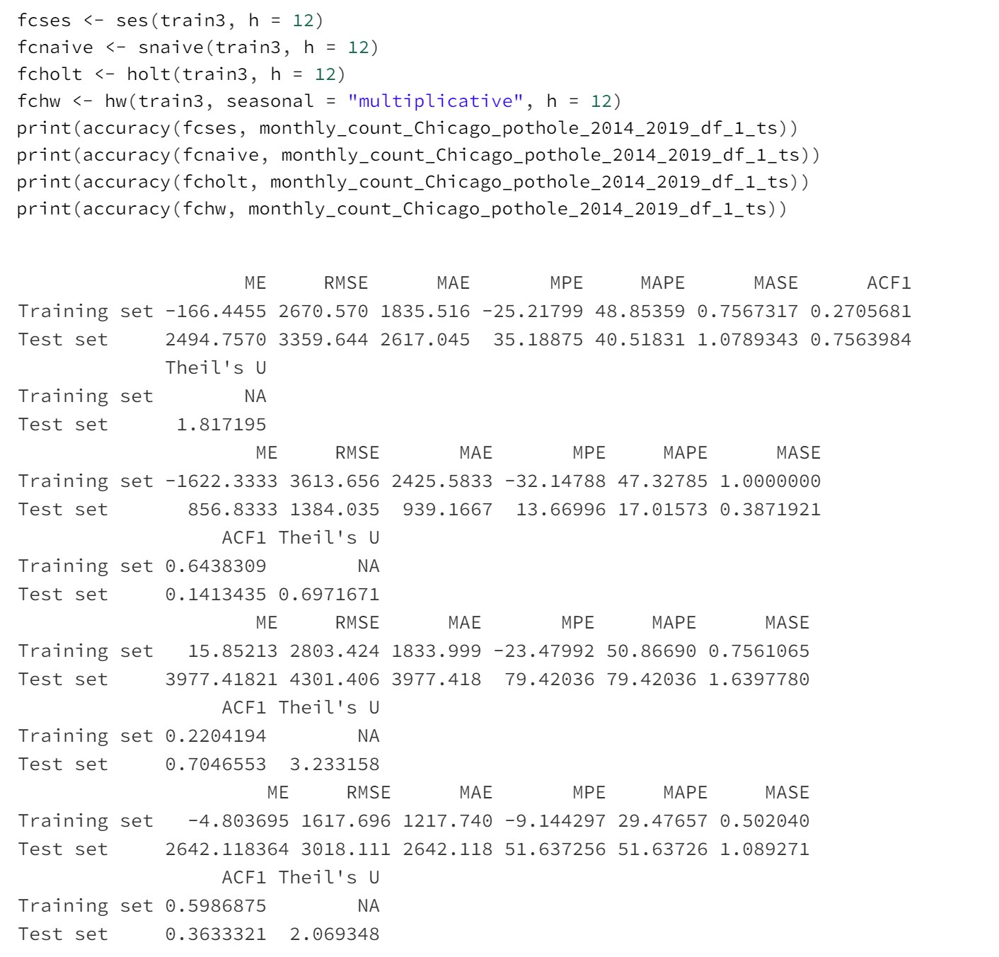

We also worked on auto ARIMA and TBATS model.

## Anamoly Detection
The time series anomaly detection is done through SparkR, ggplot2, tidyverse and anomalize (anomalize, n.d.) package. By using anomalize package we have decomposed time series, detected anomalies, and created bands separating the “normal” data from the anomalous data. The Code and detailed exploration can be referred from “Step03b_Anamoly_Detection” R Notebook from the artifacts section. Below are excerpts from this notebook.

anomalize has three main functions:
* time_decompose(): Separates the time series into seasonal, trend, and remainder components
* anomalize(): Applies anomaly detection methods to the remainder component.
* time_recompose(): Calculates limits that separate the “normal” data from the anomalies!

#### Plot anomalies:
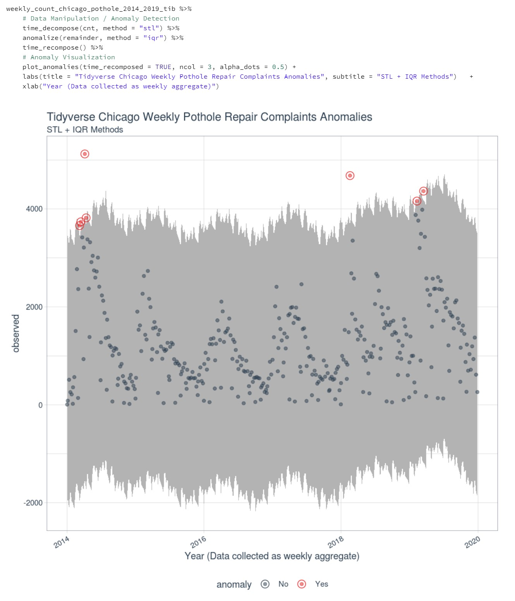

#### Decomposition of Anomalized Chicago Weekly Pothole Repair Complaints:
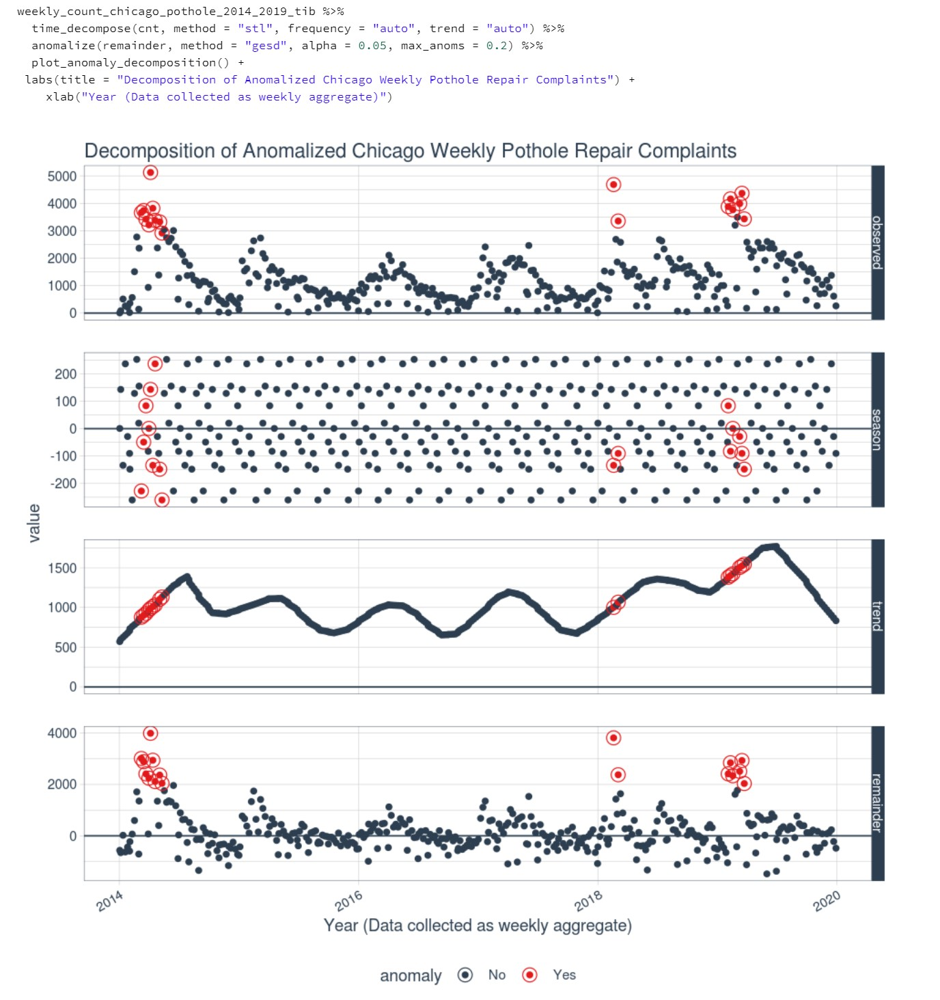

#### Extracting the actual datapoints which are anomalies:
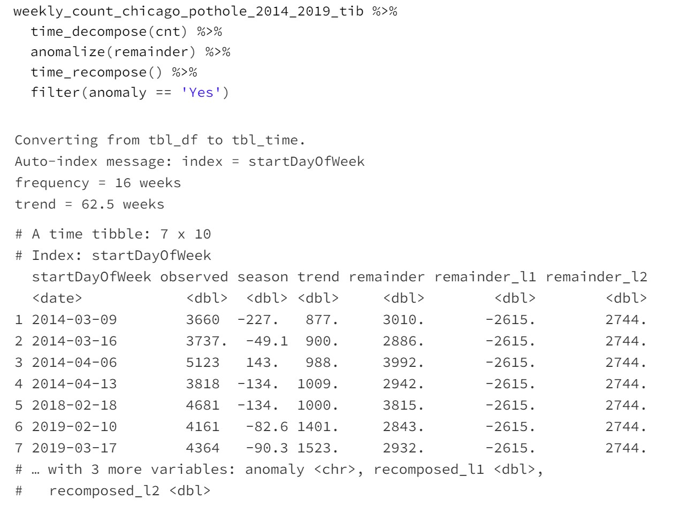

#### Observation from the data: 
Why there was bump in potholes repair complaints in 2018 February? From the records 2018 Jan-Feb had a harsh winter and flooding. Also, snow, ice and moisture all contribute to potholes, but a cycle of freezing temperatures followed by higher temperatures helps the formation of potholes. and that explains the anomaly : 

https://abc7chicago.com/chicago-weather-potholes-heavy-rain-flood-watch/3112763/ 
https://digitaledition.chicagotribune.com/tribune/article_popover.aspx?guid=0815ff4c-6db6-4166-848c-eed12b08a702

Going by the theme of our research i.e. whether the 3 cities are related let us find the anomalies in New York City and Boston also. We observe both the cities during the early 2018 had a rise in cases of pothole complaints. We also see from the data that the trends and anomalies in pothole complaints in Boston and New York City are very similar which can be attributed to their proximity and climate similarities.
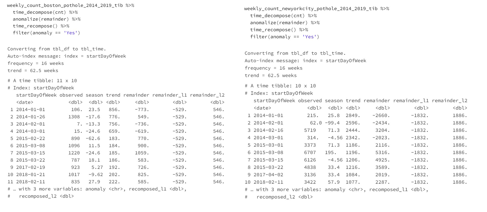

## Setup

Explain how to prepare the sample once the user clones or downloads the repository. The section should outline every step necessary to install dependencies and set up any settings (for example, API keys and output folders).

## Running the sample

Outline step-by-step instructions to execute the sample and see its output. Include steps for executing the sample from the IDE, starting specific services in the Azure portal or anything related to the overall launch of the code.

## Key concepts

Provide users with more context on the tools and services used in the sample. Explain some of the code that is being used and how services interact with each other.

## References
* (n.d.). Retrieved from parquet.apache.org: https://parquet.apache.org/
* ai/responsible-ai. (n.d.). Retrieved from microsoft.com: https://www.microsoft.com/en-us/ai/responsible-ai
* anomalize. (n.d.). Retrieved from github.com: https://github.com/business-science/anomalize
* azure.microsoft.com. (n.d.). Retrieved from https://azure.microsoft.com/en-us/services/databricks/
* Brown, J. (2012, May 31). budget-finance. Retrieved from govtech.com: https://www.govtech.com/budget-finance/Cities-Aim-to-Slash-311-Phone-Bills-Without-Affecting-311-Services.html
* data.boston.gov. (n.d.). Retrieved from https://data.boston.gov/dataset/311-service-requests
* data.cityofchicago.org. (n.d.). Retrieved from https://data.cityofchicago.org/Service-Requests/311-Service-Requests-Sanitation-Code-Complaints-Hi/me59-5fac
* data.cityofnewyork.us. (n.d.). Retrieved from https://data.cityofnewyork.us/Social-Services/311-Service-Requests-from-2010-to-Present/erm2-nwe9
* docs.microsoft.com. (n.d.). Retrieved from https://docs.microsoft.com/en-us/azure/open-datasets/overview-what-are-open-datasets
* Pothole#Costs_to_the_public. (n.d.). Retrieved from en.wikipedia.org: https://en.wikipedia.org/wiki/Pothole#Costs_to_the_public
* spark.apache.org. (n.d.). Retrieved from https://spark.apache.org/docs/latest/sparkr.html
* spark.apache.org. (n.d.). Retrieved from https://spark.apache.org/docs/latest/sql-programming-guide.html
* storage/blobs/. (n.d.). Retrieved from microsoft.com: https://azure.microsoft.com/en-us/services/storage/blobs/
* wiki/3-1-1. (n.d.). Retrieved from en.wikipedia.org: https://en.wikipedia.org/wiki/3-1-1

## Contributing

This project welcomes contributions and suggestions.  Most contributions require you to agree to a
Contributor License Agreement (CLA) declaring that you have the right to, and actually do, grant us
the rights to use your contribution. For details, visit https://cla.opensource.microsoft.com.

When you submit a pull request, a CLA bot will automatically determine whether you need to provide
a CLA and decorate the PR appropriately (e.g., status check, comment). Simply follow the instructions
provided by the bot. You will only need to do this once across all repos using our CLA.

This project has adopted the [Microsoft Open Source Code of Conduct](https://opensource.microsoft.com/codeofconduct/).
For more information see the [Code of Conduct FAQ](https://opensource.microsoft.com/codeofconduct/faq/) or
contact [opencode@microsoft.com](mailto:opencode@microsoft.com) with any additional questions or comments.
